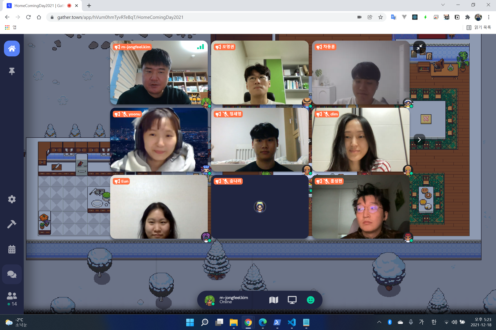
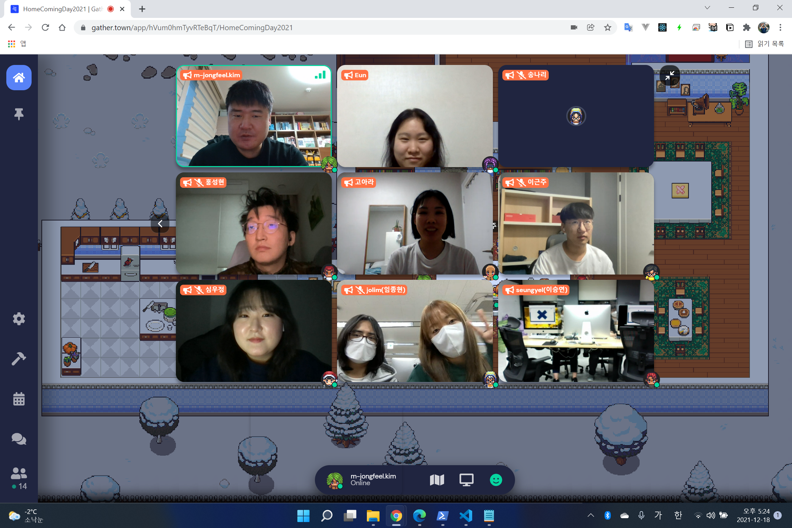

# HomeComingDay 2021 review

## Overview

코로나19가 장기화 되고, 하필 오미크론 변종 및 확진자가 급증해서 2021년도에도 온라인으로 진행하게 되었습니다.
하지만 온라인임에도 불구하고 참석해 주신 여러분들께 감사드립니다.

작년과 달리 발표자가 저를 포함 세명 뿐이어서 금방 끝날 것 같았지만\
다들 각자의 고민과 하는 일에 대한 방향에 대해 잘 공유해 주시고 얘기할 수 있는 기회였던 것 같아서 좋은 모임이었습니다.

매년 느끼는 거지만 활동하는 영역도 다르고 연령대도 다양한 분들이 모여 얘기할 수 있는게 항상 즐거운 것 같습니다.

## Gifts

올해는 발표자가 두 분 뿐이어서 상품으로 `마이크로소프트 서피스 키보드`를  준비했습니다.

심우정님은 학생이어서 아마 좋은 키보드를 안쓰고 있을 가능성이 높아서 좋은 선물이 되었을 거라 생각합니다.

또, 차동훈님의 경우는 이미 좋은 키보드를 쓰는 걸 옆에서 목격했기에 비슷한 가격대의 `로지텍 G PRO WIRELESS 무선 게이밍 마우스`를 선물해 드렸습니다.

### Donghoon's game winner

작년에 이어 올해도 제가 게임을 준비하려고 했는데, 동훈님이 준비하신다고 해서 좋았던 것 같습니다. 선물 역시 동훈님 사비로 해서 너무 놀라웠고, 또 고마웠습니다.

- 1등 심우정: BBQ 황금올리브치킨 + 코카 콜라 1.25L
- 2등 최예지: 스타벅스 카페 아메리카노 T + 7 레이어 가나슈 케이크 => 이건 제가 가져가고 더 좋은 `사랑해요 세트`로 업그레이드 해서 드렸습니다.
- 3등 소은영: 스타벅스 카페 아메리카노 T

동훈님이 저에게 기프티콘을 전달했고, 제가 알아서 각색(?) 해서 전달 드렸습니다.
저도 그렇고 다들 즐거우셨으리라 생각합니다!

### Presenter

발표는 두 분 뿐이라 자연스럽게 차동훈님에게 퀴즈 + 발표 시간을 드렸고 상대적으로 발표 준비 하는데 시간이 부족하다고 하신 심우정님에게는 뒤에 발표할 기회를 드렸습니다.

- 차동훈 - [메타버스와 유니티 개발자의 기회](https://github.com/ThinkAboutSoftware/HomeComingDay/blob/main/2021/Presentations/HomeComingDay2021_donghun.pptx)
- 심우정 - 2021년 회고 (연락되면 업데이트 예정)

## Photos

기념사진입니다. 참여하신 분이 많아서 두 컷에 담았습니다.
알게 모르게 저보다 더 많은 스크린샷을 찍고 후기를 올려주신 [조윤우님의 글](https://github.com/ThinkAboutSoftware/HomeComingDay/issues/31)을 보셔도 좋을 것 같습니다. 감사합니다.

저는 참석하신 모든 분들에게 메시지를 남겨 보려고 합니다.

이름에 github 링크를 걸어 뒀습니다. 나중에 개인적으로 관심 있는 분들은 방문해보시면 좋을 것 같아요.

### [차동훈님](https://github.com/Joseph-Cha)

여러 모로 제 행사를 빛내 주신 분으로 생각하고 있습니다. 저와 함께 했던 한 해를 돌아보면 온라인 모각코, 개인 멘토링, arcademic conference, home coming day 발표 까지 1년차 주니어임에도 불구하고 왕성한 활동을 해 주셔서 너무 감사합니다. 앞으로도 계속 좋은 모습을 보여주셨으면 좋겠고, 저와도 종종 얘기를 많이 했으면 좋겠습니다.

### [조윤우님](https://github.com/zoops)

윤우님 발표까지 하셨으면 3년 개근 + 3년 연속 발표의 영광을 얻으실 수 있었는데 아쉽습니다. 바쁜 와중에도 종종 소식 전해주시고, 행사에도 관심 가지고 참여해 주셔서 감사합니다. 내년에 academic conference로 또 많은 얘기할 기회가 생겼으니 좋은 것 같습니다. 저희 나이가 보통 나이가 아니기 때문에 항상 건강하셨으면 합니다 ㅎㅎ

### [이근주님](https://github.com/GeunJuLEE)

근주님도 역시 3년 개근해 주셔서 너무 감사합니다. 일상에 항상 바쁘지만 행사 한다고 하면 빠르게 회신 주시고 적극적인 참여 의사를 주셔서 고맙습니다. 이제 3년차 정도 경력이 있으신데, 현재 하는 일에 대한 어려움과 고민에 대해 얘기해 주시고 같이 들을 수 있어서 좋았습니다. 제 기억으로 실력도 좋으시고 집중력 또한 엄청났던 걸로 기억해서요 지금 회사 말고도 다른 곳에서도 충분히 좋은 역량을 발휘하실 거래 믿습니다.

### [송나리님](https://github.com/songnari)

42서울에서 우연치 않게 면접 준비에 대한 멘토링 하면서 알게 됐고, 이번 행사에 참여해 주셔서 감사합니다. 취업 하신지 두 달 조금 넘었는데, 회사에서 하는 일이 크게 마음에 들지는 않는 것 같지만, 주어진 미션에 충실히 진행해 보시고 결과에 대한 평가를 어떻게 해주는지에 따라서 이후 방향을 정해 보셔도 좋을 것 같습니다.

### [변지혜님](https://github.com/wisdom08)

독서 모임하다가 알게 되고 한번 멘토링 진행했었는데, 잊지 않고 행사에 참여해 주셔서 감사드립니다. 온라인 모각코 계속 하고 있으니까 참여해 주시면 좋을 것 같고, 이후에 academic conference 2022도 참여해 주시면 좋을 것 같습니다. 중간에 얘기 없이 나가셔서 얘기를 못했지만, 내년에도 좋은 인연으로 뵜으면 좋겠네요.

### [권영언님](https://github.com/kyu9341)

작년에는 취업 준비로 아쉽게 참여 못하셨는데 올해는 참여해 주셔서 너무 반갑고 감사합니다. 저의 멘티 레퍼런스로 영언님이 top 티어이기에 종종 얘기해 드리고 있어요, 워낙에 목표가 뚜렷하셨고 열심히 준비하셨기 때문에 이룬 성과라고 생각합니다. 거기서 좋은 개발자 필요할 때 종종 연락주세요 ㅎㅎ

### [심우정](https://github.com/ShimWooJeong)

제가 아는 분 중에는 하이텐션의 끝판왕이신 우정님, 광고를 많이 해서 그런지 적극적으로 참여해 주셔서 감사합니다! 시험기간인데도 부족한 시간을 쪼개서 좋은 발표도 해주셔서 감사합니다. 잘 들었어요. 토요일 모각코 시간이 의미 있었던 시간이라고 해 주셔서 감사합니다. 공부도 하고, 스타벅스 커피 쿠폰도 타가는 좋은 시간이었다고 생각합니다. 내년에도 좋은 모습으로 만나뵜으면 좋겠습니다!

### [정세영](https://github.com/JSY8869)

작년 부터 해서 꾸준히 했던 알고리즘 문제 풀기 스터디를 완료 해 주셔서 감사합니다. 아마 멘토링 프로젝트 중에는 완료가 되는 첫 사례가 아닐까 싶습니다. 내년에도 한이음으로 뵈면 좋을 것 같고 개발자로 취업하기 위해서 공부 하실 때 저랑도 종종 많은 얘기를 했으면 좋겠습니다. 물론 맛있는거 먹으면서요!

### [임다솜](https://github.com/dimfrom42)

42서울에서 dim 이라는 아이디로 잠깐 얘기했던 기억이 있는 분이었는데, 역시 제 행사에 참여해 주셔서 감사합니다. 내년에도 멘토링 필요하면 좋은 얘기를 해드리고 싶은데, 많은 관심 가져주시면 좋겠습니다. 소극적이라고 하셨는데, 이런 행사에 참여할 정도면 그래도 좋은 자세인건 맞습니다. 소극적이더라도 조금은 적극적으로 활동 해보시면 개발 외에도 생각의 틀을 깰 수 있는 많은 기회가 있을 거에요.

### [이승연](https://github.com/2winyear)

42서울에서 seungyel로 암암이라 활동하시는 거 같은데, 어떻게 진로를 정할지에 대한 건 여러 가지를 해 보면서 찾아봤으면 좋겠습니다. 인터뷰 해주셨을 때 고맙다는 얘기를 못해드린거 같은데, 제가 여러가지 얘기를 할 수 있게 해주셔서 감사드립니다. 내년에도 계속 좋은 모습으로 뵜으면 합니다.

### [최예지](https://github.com/yechoi42)

예지님도 저에게 따로 참석 요청을 안하신 준호님과 같이 참석해 주셔서 감사합니다. 처음에 얘기한지 얼마 안되서 취업 하고, dev-rel 이라는 포지션에 들어갔다는 사실에 많이 신기해 했었습니다. 저도 말로만 들었지 실제 그 포지션에 일하는 사람을 알게(?) 됐다는 사실만으로도요. 이후에도 종종 42seoul에서 중요 이벤트가 있을 때 뵈면 좋을 것 같습니다.

### [임종현](https://github.com/evelon)

종현님도 참석해 주셔서 반갑습니다. 42 게더타운에서 우연히 만나고 잠깐 얘기를 나누면서 남다른 생각을 가지신 분이라고 생각했습니다. 특히 집현전이라는 활동을 하고 계신 부분에 대해서 제가 하고 있는 academic conference에 함께 하면 좋겠다는 생각도 들었습니다.

### [모영권](https://github.com/momoci99)

영권님은 동훈님과 함께 거의 내부고발자 2호이시기도 하고 또 저와 small talk도 많이 하시는 분인데, 또 이렇게 제 행사에 참석해 주셔서 반갑습니다. academic conference에 참여 시키기 위해 제가 계속 얘기해 드리고 있는데 내년에도 버넥트에서 좋은 모습으로 뵙길 희망합니다.

### [소은영](https://github.com/eunyeong-so)

은영님은 home coming day 2021에서도 말씀 드렸지만, 특별한 신입으로 제가 다른 분들에게 많이 소개해 드린 분이기도 합니다. 같은 팀의 테크니컬 리더인 저와 최연소+최저연차 신입인 은영님의 차이는 매우 크지만 대화하거나 얘기할 때 그렇지 않게 대해 주셔서 감사합니다. 모각코도 많이 참여해 주시기도 해서 내년에도 회사에서 그리고 모각코에서도 좋은 모습으로 뵜으면 좋겠습니다.

### [고아라](https://github.com/aralaa)

아라님은 우연 그리고 연락이 될 수 밖에 없었던 필연 적인 사건으로 연락이 되서 아주 반가웠고, 또 잊지 않고 제 행사에 참여해 주셔서 아주 감사드립니다. 그리고 현재 일하고 있는 부분에 대해서 고민이 여러가지 많으신 것 같은데, 작년에 멘토링 했던 걸 생각해 보셔서 개발 쪽으로 조금 더 하실 마음이 있으면 언제든지 연락 주시고 방향성에 대한 고민을 같이 해보면 좋을 것 같습니다.

### [홍성현](https://github.com/hongsam14)

성현님도 42서울에서 게더타운으로 만나고 바로 멘토링도 몇 번 하면서 많은 이야기를 나눈 분 중에 하나였던 것 같습니다. 42서울에서 하는 다른 멘토님이 봐주는 프로젝트인데도 저한테도 멘토링 받고 했던 내용이 신선하기도 했습니다. 아마 내년에도 계속 개발 관련된 얘기 하면서 멘토링 많이 하게 될 것 같고, 학교로 복귀 하면 도자기과로 다시 가시더라도 개발은 쭉 하셨으면 좋겠네요.

### [원준호](https://github.com/jwon42)

42서울에서 우연치 않게 얘기를 하다가 인터뷰 동아리도 알게 해주고 또 저도 인터뷰 해 주시고 해서 여러 모로 인상 깊었던 분입니다. 특히 저희 회사에 찾아와 용산의 명물 오근내 닭갈비를 먹으면서 진로에 대한 고민 취업에 대한 고민 그리고 결혼에 대한 고민 등 많이 얘기했었는데, 내년에는 꼭 원하는 바를 이루시길 희망합니다.

### 그 외

참여 의사를 주셨으나 개인 사정이나, 시간이 안맞아서 못오신 분들입니다.
내년에는 꼭 뵜으면 좋겠습니다.

- [정혜인님](https://github.com/hi-hyein)
- [박원정님](https://github.com/WonjeongPark)
- 김희성님
- 지상훈님
- 손민재님

## Promises to next home coming day

### Swing dance with 팽대원님

작년 home coming day때 대원님과 함께 스윙댄스를 준비해서\
올해 home coming day때 보여드리기로 했는데\
오프라인으로 개최가 되지 않은 것도 있지만
제가 코로나 백신을 맞고 오른쪽 다리 상태가 안좋아져서 못하게 됐습니다.

한달 전까지만 해도 뛰는 것도 힘들었는데, 지금은 조금 괜찮아 진 것 같네요.

하지만 여름에 함께 연습했던 동영상을 공개해 드리겠습니다!

### Upgrade gift

올해는 참석자 선물, 간식 등을 준비하지 못해서 아쉬웠지만 내년에 오프라인으로 개최된다면 올해 해드리지 못했던 걸 더욱 업그레이드시켜 (물론 스폰서가 등장하기 전까지 제 사비를 탈탈 털어) 여러분들에게 좋은 선물을 드릴 걸 약속드립니다.

## Thank you

- 모임 관련 아이디어: 선물, 기획, 장소 등
- 각자 느꼈던 후기
- 저한테 혹은 다른 분들에게 할 이야기
- 그냥 뭔가 쓰고 싶다면 issue에 적어주세요

감사합니다.