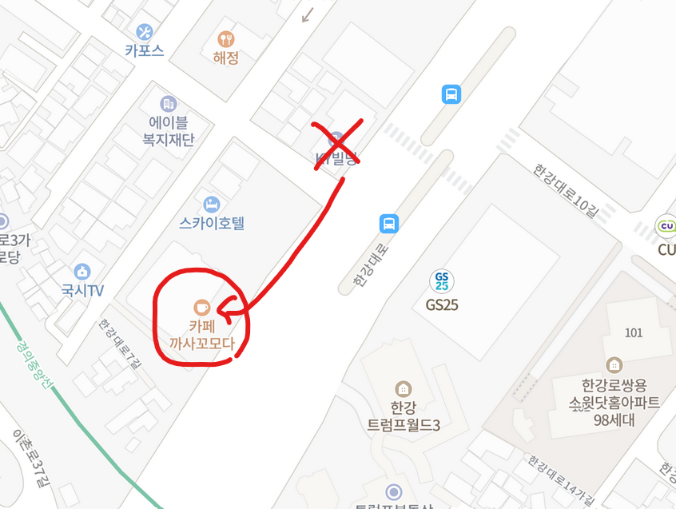
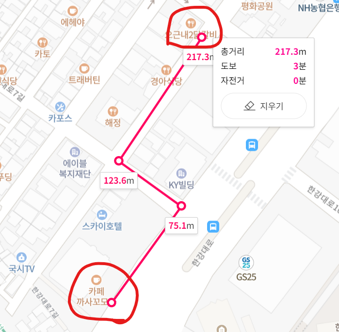
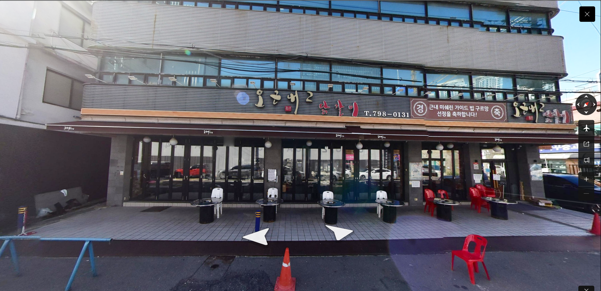
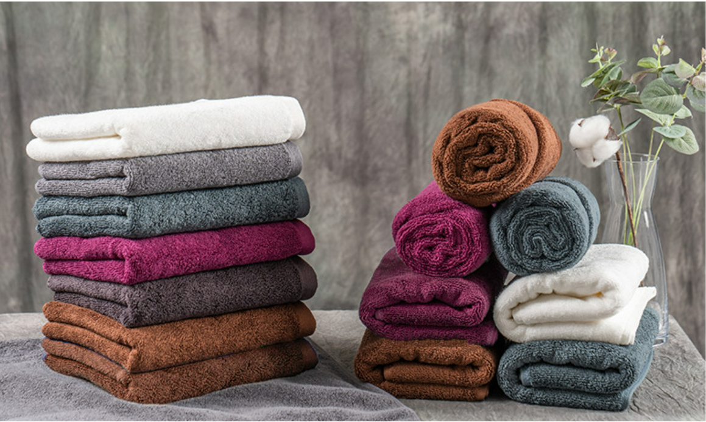
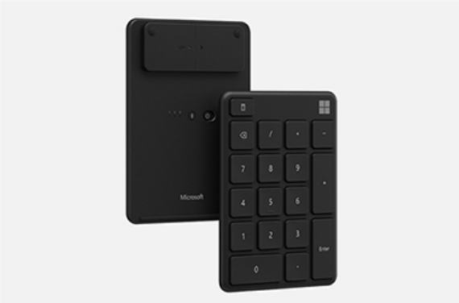

# HomeComingDay 2022

이 모임이 무엇인지에 대한 내용은 [모임 취지](WhyHomeComingDay.md)를 참고하세요.

## Overview

- 일시: 2022년 12월 17일 토요일 오후 3시 ~ 오후 7시 4시간
- 장소: 서울 용산구 한강대로 23 베르가모빌딩 1층, 까페 까사꼬모다
- 참가비: 없음
- 일정
  - 간단한 자기 소개, 늦게 오신 분도 자기 소개 필수!
  - 발표자 신청하신 분들이 순서대로 발표하고 질문/답변 하는 시간 진행
  - 익명으로 내용 제보한 내용에 대한 talk
  - (원하는 분에 한해) 저녁 식사, 오근내2닭갈비 예상

## Presentation

발표 회신 메일을 보내는 분을 일단 적어둘 예정이고 발표 순서는 나중에 정합니다.
물론 제가 첫 발표를 합니다.

- 김종필: 2022년 멘토링 활동 정리 및 개인 활동 소개

## 참가자 선물

- 고오급 타월 세트를 한 장이 아니라 무려 두 장을 드릴 예정입니다.
- 색은 랜덤으로 살 예정이며, 오시는대로 원하는 색 두 장을 고르시면 선물용 케이스에 담아 드립니다
- 

## 발표자 선물

- 마이크로소프트 무선 넘버패드 블루투스를 선물로 드릴 예정입니다.
- 비슷한 가격대로 변경하고 싶으신 분은 issue에 남겨주세요. 얼마든지 가능합니다.
- 

## Go ahead!

- 어? 뭔가 말하고 싶다 하시면 이제 [Issue](https://github.com/ThinkAboutSoftware/HomeComingDay/issues) 탭에 의견을 남겨주시면 됩니다.

## Review

- 후기 추가 예정