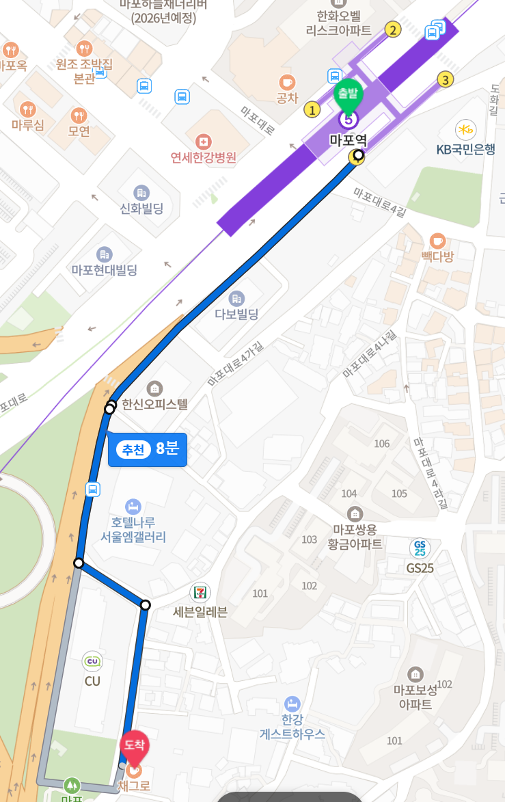

# HomeComingDay 2023

이 모임이 무엇인지에 대한 내용은 [모임 취지](WhyHomeComingDay.md)를 참고하세요.

## Overview

- 일시: **2023년 12월 16일 토요일 오후 1시 ~ 오후 6시, 5시간**
- 장소: **서울 마포구 마포대로4다길 31, 채그로 북까페 B1 강의실**
- 참가비: 없음
- 다과
  - 음료 및 과자 준비 예정
- 일정
  - 간단한 자기 소개, 늦게 오신 분도 자기 소개 필수!
  - 발표자 신청하신 분들이 순서대로 발표하고 질문/답변 하는 시간 진행
  - 저의 발표를 짧은 시간에 네번 혹은 다섯번 정도 발표자 중간에 한번씩 진행 예정
    - 2023 멘토링 활동 요약 - 20분
    - 2023 리드잇진 글 기고 6호, 7호, 8호 - 10분
    - 2023 이직 경험기 - 10분
    - Academic Conference 2023 소개 - 10분
    - 업그레이드 된 온라인 모각코 소개 - 10분

## Presentation

발표 회신 메일을 보내는 분을 일단 적어둘 예정이고 발표 순서는 나중에 정합니다.
물론 제가 첫 발표를 합니다.

## 참가자 선물

- 답례품으로 많이 선택하는 믹스넛을 준비할 예정입니다.

## 발표자 선물

- 작년에 원하는 선물을 얘기해주신 분이 많아서 올해는 선물을 주문받아서 드릴 예정입니다.
- 몇 만원 내외의 원하는 걸 알려주시면 준비해드리겠습니다.

## Go ahead!

- 어? 뭔가 말하고 싶다 하시면 이제 [Issue](https://github.com/ThinkAboutSoftware/HomeComingDay/issues) 탭에 의견을 남겨주시면 됩니다.

## Review

- 후기 추가 예정